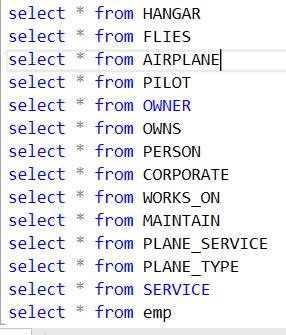
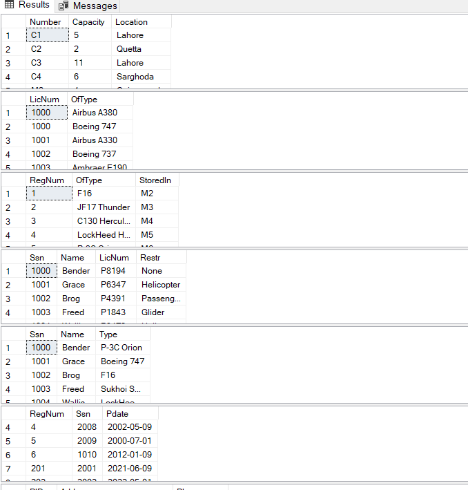
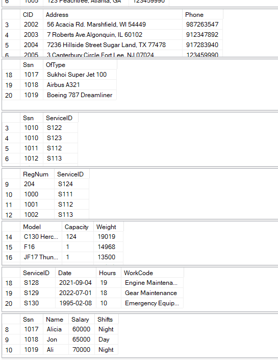
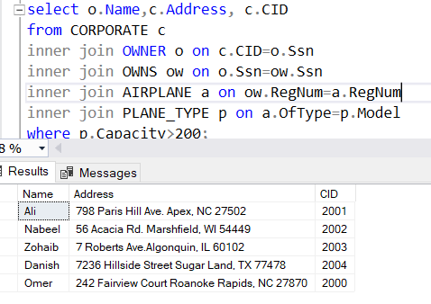
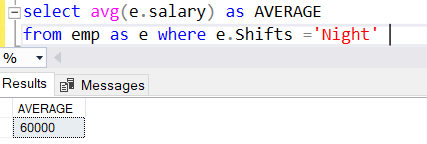
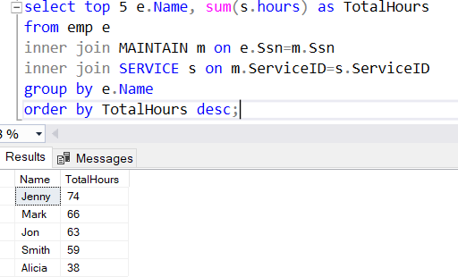

🔍 SQL Queries
This section details the various SQL queries implemented, categorized by their purpose and the concepts they demonstrate. Queries are divided by contributor for clarity.

Queries by Haniya (01, 05, 07-09, 13-18, 25)
QUERY 01 - ERD Explanation
Description: This section provides a detailed textual explanation of the ERD diagram, outlining the superclass/subclass relationships, entity attributes, and the rationale behind the linkages (as described in the ERD section above).

!

QUERY 02 - Table Content Display
Description: Displays the content saved in various tables, demonstrating basic SELECT * FROM TableName operations.

!

QUERY 03 - Planes Never Maintained
Description: Uses a SQL nested query to find the registration numbers of airplanes that have never undergone maintenance.

!

QUERY 04 - Corporate Owners of Large Planes
Description: Finds names and addresses of corporate owners who own planes with a capacity greater than 200, connecting Corporate, Owner, Owns, Airplane, and Plane Type tables using joins.

!
QUERY 05 - Average Night Shift Salary
Description: Finds the average salary of employees who perform the night shift, utilizing the AVG() aggregate function.

!

QUERY 06 - Top 5 Maintenance Hours Employees
Description: Displays the top 5 employees with the highest maintenance work hours, utilizing the SUM() aggregate function.

!

QUERY 07 - Recent Maintenance
Description: Identifies the names and registration numbers of airplanes that have undergone maintenance in the past week, using date library functions like DATEADD and GETDATE(), alongside a nested query.

!

QUERY 08 - Recent Plane Purchases
Description: Retrieves the names and phone numbers of all owners who have purchased a plane in the past month. Employs the LIKE operator for date filtering and LEFT JOIN for connecting multiple tables, ensuring distinct entries via primary and foreign keys.

!

QUERY 09 - Total Pilots Per Plane Type
Description: Calculates the total number of pilots authorized to fly each type of plane, using GROUP BY and joining multiple tables.

!

QUERY 10 - Hangars with Available Space
Description: Shows all data stored in hangars that have more available space, joining Hangar, Plane Type, and Airplane tables.

!

QUERY 11 - Number of Airplanes Owned by Corporations
Description: Uses joins to show the number of airplanes owned by each corporation.

!

QUERY 12 - Average Maintenance Hours Per Plane
Description: Calculates the average number of maintenance hours per plane using the AVG() aggregate function.

!

QUERY 14 - Owners with Same Location as Corporation's Hangar
Description: Lists names and phone numbers of owners who bought a plane from a corporation with a hangar in the same location as the owner. Joins are performed based on location.

!

QUERY 15 - Pilots of Planes Under Maintenance
Description: Identifies the names of pilots who can fly a plane that is currently undergoing maintenance, using nested queries, LIKE operator, and WHERE EXISTS.

!

QUERY 16 - Employees by Maintenance Hours for a Corporation
Description: Finds employee names who have worked on planes owned by a specific corporation, sorted by total maintenance hours worked. Uses LEFT JOIN for data retrieval and GROUP BY for aggregation.

!

QUERY 17 - Airplanes Never Owned by Corporation or Day Shift Maintained
Description: Lists names and registration numbers of airplanes that have never been owned by a corporation or maintained by a day-shift employee. Achieved through table joins, WHERE conditions, and a nested query.

!

QUERY 18 - Corporations Purchasing Same Plane Type Recently
Description: Identifies names and addresses of owners who purchased a plane from a corporation that also purchased a plane of the same type in the past month. Employs INNER JOIN based on primary/foreign keys and the LIKE operator for string matching.

!

QUERY 19 - Total Planes Per Hangar
Description: Counts the total number of planes in each hangar, joining the Hangar and Airplane tables with COUNT().

!

QUERY 20 - Total Planes by Type
Description: Determines the total number of planes for each plane type, joining the Airplane and Plane Type tables.

!

QUERY 21 - Number of Services Performed on Each Plane
Description: Finds the number of services performed on each plane, joining Airplane and Plane Service tables and using COUNT().

!

QUERY 22 - Average Salary Per Shift
Description: Calculates the average salary for each shift (day and night).

!

QUERY 23 - Total Planes Owned by Owners
Description: Finds the total number of planes owned by owners (both corporations and persons), joining Owner and Owns tables.

!

QUERY 24 - Planes Authorized Per Pilot
Description: Figures out the number of planes each pilot is authorized to fly, using the Pilot and Flies tables with COUNT().

!

QUERY 25 - Multi-Purpose Query Examples
Description: Contains a set of diverse query examples, including:

Incrementing salary for specific employees working on a specific model.

Identifying pilots who own and fly airplanes.

Selecting hangar space based on availability.

Selecting persons living in a specific region.

!
